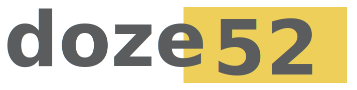
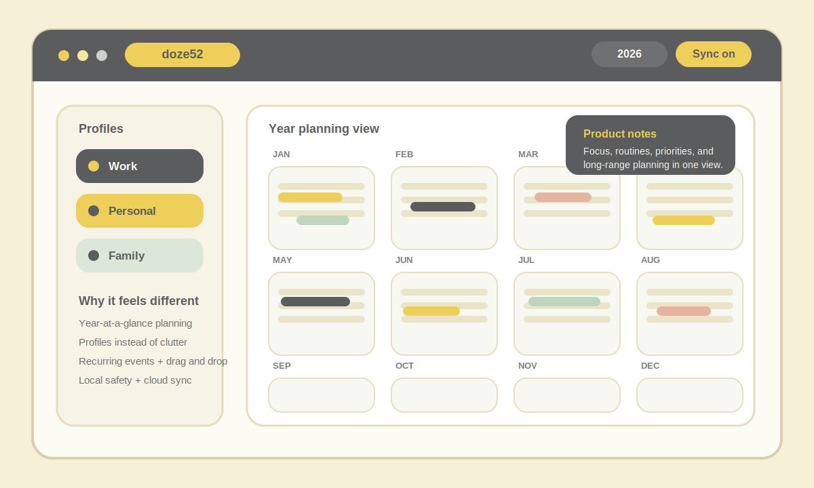

<p align="center">
  
</p>

# doze52

**Visual year planning for focus, routines, and long-range organization.**

doze52 is a product-in-progress built by Conrado Vidal. It is for people who think better when they can see the whole year, not only the next task list.

The product combines a year-at-a-glance calendar, profile-based planning, categories, recurrence, and lightweight sync so planning feels visual, intentional, and usable in real life.

<p align="center">
  
</p>

## Why this exists

Most planning tools are great at tasks and weak at horizon.

doze52 exists to help people structure focus across weeks, months, and the full year. The product direction is simple: less friction, more clarity, and a planning view that supports long-range thinking.

## What you can do today

- See the full year in one visual grid.
- Organize contexts with calendar profiles such as work, personal, or family.
- Create categories and multi-day events with drag-and-drop editing.
- Use weekly, biweekly, monthly, and yearly recurrence.
- Sign in with Google and sync your planning data with Supabase.
- Export your data as JSON and CSV.

## Current stage

- Early public version, already usable.
- Strongest focus today: calendar clarity, profile-based planning, and sync reliability.
- Product evolution is being organized in public through the in-app `Melhorias & Prioridades` area.

## Product decisions that matter

- **Year-first UX**: the main view is the year, not a hidden secondary mode.
- **Profiles before complexity**: work, personal, and other life contexts stay separated without heavy setup.
- **Local safety + cloud sync**: the product protects local progress while keeping signed-in data synced.
- **Polish is product work**: legibility, drag behavior, layout density, and modal flow are treated as core experience.

## Roadmap right now

- Turn the public improvements area into a clearer backlog and prioritization surface.
- Keep improving sync resilience and trust signals.
- Refine onboarding so the value of year planning becomes obvious faster.
- Continue making the calendar denser, calmer, and easier to scan.

## Built with

- Next.js 16
- React 19
- Supabase
- Zustand
- Tailwind CSS 4

## Run locally

```bash
npm install
npm run dev
```

Open [http://localhost:3000](http://localhost:3000).

## Product and repo contact

- Product repo: [github.com/conradovidal/Doze52](https://github.com/conradovidal/Doze52)
- Instagram: [instagram.com/doze.52](https://instagram.com/doze.52)
- X: [x.com/doze_52](https://x.com/doze_52)
- Email: [doze52cal@gmail.com](mailto:doze52cal@gmail.com)

<details>
<summary><strong>Environment model</strong></summary>

All Supabase configuration is read only from:

- `NEXT_PUBLIC_SUPABASE_URL`
- `NEXT_PUBLIC_SUPABASE_ANON_KEY`

Use different values by environment:

1. Local (`.env.local`)
   Point both vars to the **Doze52 Dev** Supabase project.
2. Vercel Preview
   Set both vars in the **Preview** environment to the **Doze52 Dev** project.
3. Vercel Production
   Set both vars in the **Production** environment to the **Doze52 Prod** project.

Behavior:

- In non-production, the app logs `[supabase] <NEXT_PUBLIC_SUPABASE_URL>` once in the browser console.
- In production, this log is disabled.
- If vars are missing, the app keeps running and shows a warning in the home UI:
  `Supabase nao configurado neste ambiente.`
- Never expose `service_role` in frontend env vars or client code.

Environment badge:

1. Local: set `NEXT_PUBLIC_APP_ENV=local` and `NEXT_PUBLIC_SHOW_ENV_BADGE=true`.
2. Vercel Preview: set `NEXT_PUBLIC_APP_ENV=dev`.
3. Vercel Production: set `NEXT_PUBLIC_APP_ENV=prod`.
4. In production, the badge only appears when `NEXT_PUBLIC_SHOW_ENV_BADGE=true`.
5. Valid values for `NEXT_PUBLIC_APP_ENV`: `local | dev | prod`.
</details>

<details>
<summary><strong>OAuth checklist</strong></summary>

1. Supabase Auth URL Configuration:
   - Site URL = current environment URL.
   - Redirect URLs include:
     - `http://localhost:3000/auth/callback`
     - `http://localhost:3000/auth/callback/popup`
     - `http://localhost:3000/auth/popup-callback`
     - `http://127.0.0.1:3000/auth/callback`
     - `http://127.0.0.1:3000/auth/callback/popup`
     - Preview and production equivalents for `/auth/callback`, `/auth/callback/popup`, and `/auth/popup-callback`.
2. Google Cloud OAuth client:
   - Authorized redirect URIs: `https://<SUPABASE_PROJECT_REF>.supabase.co/auth/v1/callback`
   - Authorized JavaScript origins: `https://<SUPABASE_PROJECT_REF>.supabase.co`
3. Preview wildcard, if Supabase allows it:
   - `https://*-<team-or-project>.vercel.app/auth/callback*`
4. Validate in browser Network:
   - Supabase `/auth/v1/authorize` must send `redirect_to=<current-origin>/auth/callback/popup`
   - Never allow preview or production to send `redirect_to=http://localhost:3000/...`
5. Stage and preview `NEXT_PUBLIC_SUPABASE_URL` must point to the same Supabase project where these redirect URLs were configured.
</details>

<details>
<summary><strong>Migrations, backups, and audits</strong></summary>

Before changing schema in production, create backup dumps:

```bash
supabase db dump --db-url "$SUPABASE_DB_URL" --schema public --file supabase/backups/schema_YYYYMMDD.sql
pg_dump "$SUPABASE_DB_URL" --data-only --table public.categories --table public.events > supabase/backups/data_YYYYMMDD.sql
```

Apply migrations:

```bash
supabase db push
```

Version all SQL migrations in `supabase/migrations/`.

Security audit quick check:

```bash
rg -n "service_role|SUPABASE_SERVICE_ROLE|sb_secret|sbp_"
```

DEV migration checklist:

1. Via Supabase CLI:
   - `supabase link --project-ref <DEV_REF>`
   - `supabase db push`
2. Via SQL Editor, execute in order:
   - `supabase/migrations/0001_init.sql`
   - `supabase/migrations/0002_rls.sql`
   - If needed, run incremental files `supabase/migrations/20260212_*.sql`
   - For multi-day ordering with `day_order` int and `notes`, run `supabase/migrations/20260219_04_events_day_order_int_notes.sql`
3. Checklist de env vars:
   - `NEXT_PUBLIC_SUPABASE_URL`
   - `NEXT_PUBLIC_SUPABASE_ANON_KEY`
   - Local and preview should target DEV; production should target PROD.
4. Confirm tables used by sync (`loadRemoteData`, `saveSnapshot`, `exportUserData`):
   - `public.categories`
   - `public.events`
   - `public.calendar_profiles`
5. Confirm minimum RLS and policies per table:
   - RLS `enabled` and `force`
   - Policies `SELECT/INSERT/UPDATE/DELETE` with `auth.uid() = user_id`
6. Validate after login:
   - Home loads without `Banco DEV sem tabelas/migrations...`
   - Create, update, and delete category or event persists after reload.
</details>
