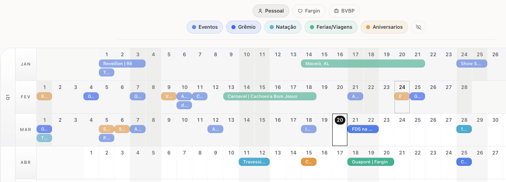

# Doze52

A year-in-view tool for planning priorities, reviewing patterns, and seeing the whole year clearly.



## What it is

Doze52 is a visual planning and review tool designed to help people see the full year at once, organize what matters, and reflect on patterns over time.

## Why it exists

Most calendars are built for scheduling hours and tasks. Doze52 is built for yearly clarity, intention, and review.

## Current scope

- Year view
- Event organization
- Visual planning
- Ongoing UX refinement

## Roadmap

- Monthly review flow
- Habit tracking
- Better personal insights
- Mobile-first interactions

## Tech stack

- Next.js
- TypeScript
- Supabase
- Vercel

## Running locally

```bash
npm install
npm run dev
